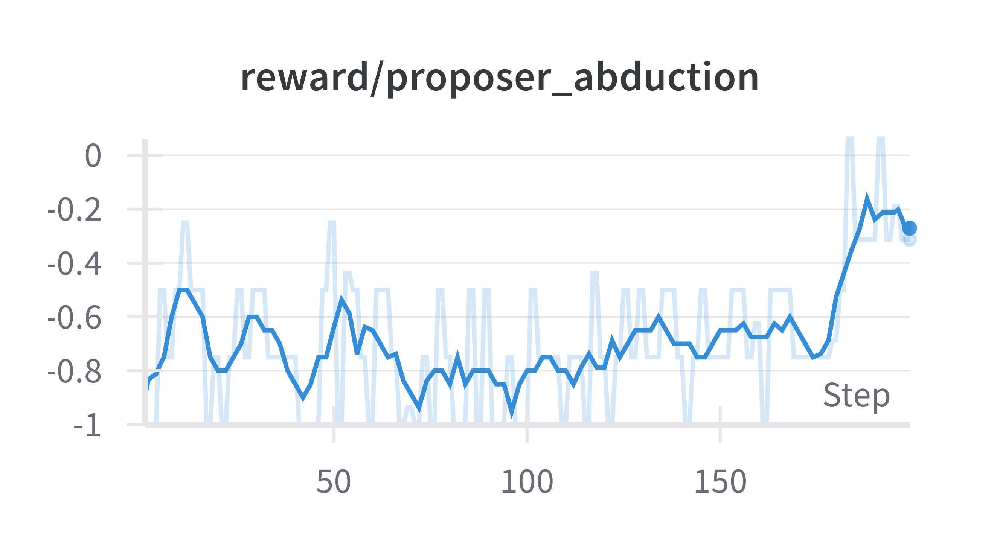
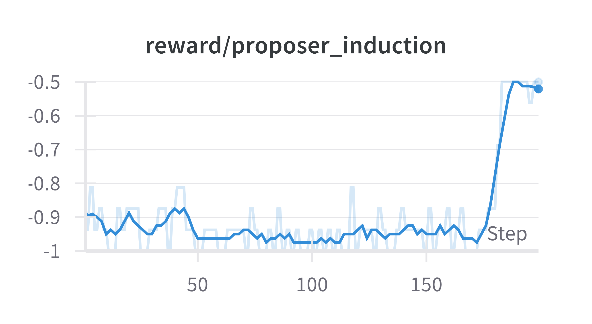
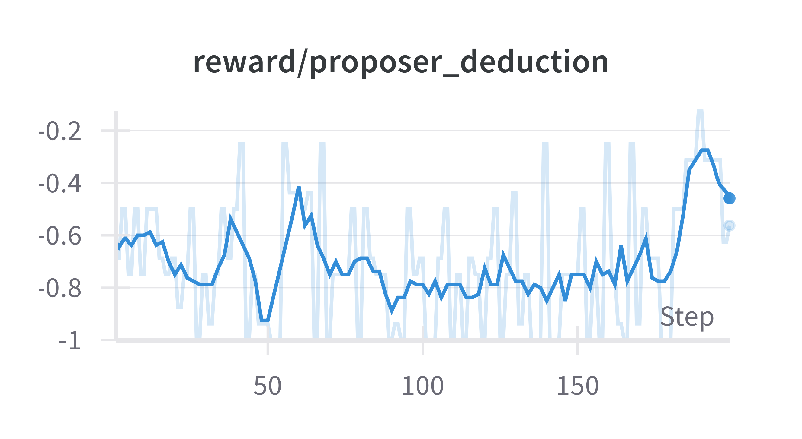
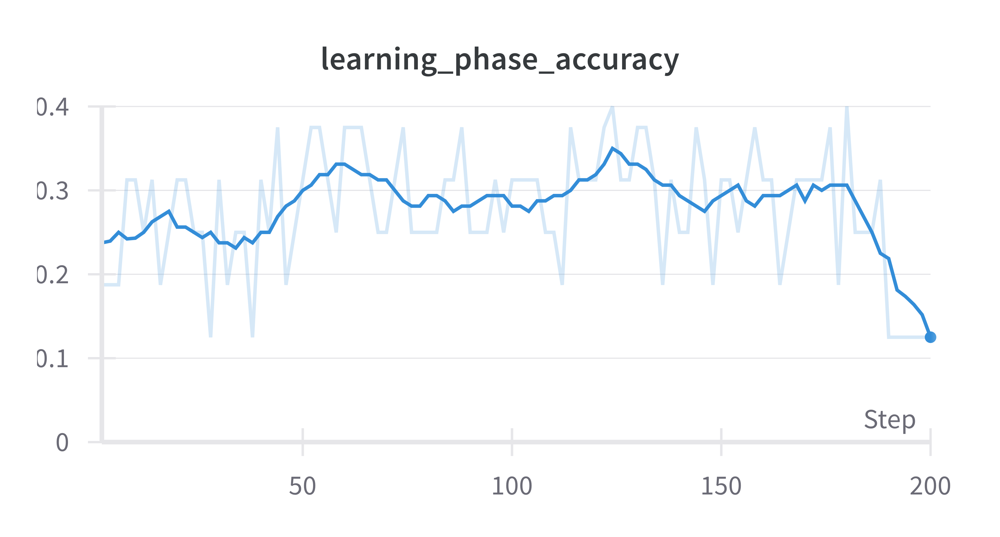
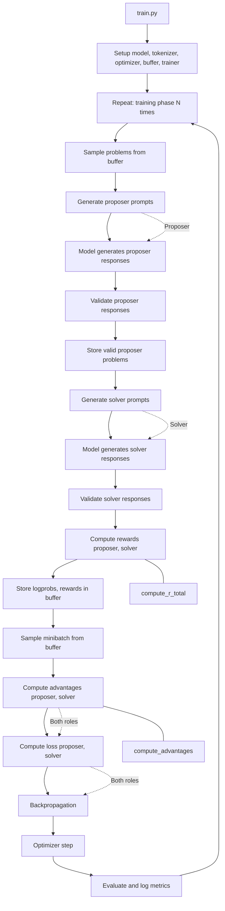

# Absolute Zero: Reinforced Self-play Reasoning with Zero Data

This is a reproduction of the method of reinforcement learning (self-play with task-relative REINFORCE++) used in the paper [Absolute Zero: Reinforced Self-play Reasoning with Zero Data](https://arxiv.org/abs/2505.03335?context=cs.LG). Our setup differs in that instead of generating Python programs as the paper does, we instead adapt the setup to the prime inversion problem.

## Problem

Our project attempts to teach the model the equation

$$xy \equiv 1 \pmod{p} \text{ , } p \text{ prime}$$

The induction task from the paper becomes a task to solve for $x$, e.g. 

$$x \times 4 \equiv 1 \pmod{7}$$

and we can determine that, uniquely, $x \equiv 2 \pmod{7}$ in this example.

The abduction and induction tasks are determined in the same way, where the solver has to solve for $y$ and $p$ respectively. Like the induction task in the paper, multiple primes are possible, and we will accept any of those that fulfill the task for a given $x$ and $y$.

We can control the computational difficulty of the problem by increasing the size of possible $p$ candidates. This makes this problem more amenable to RL since we are able to tune the problem difficulty to match the initial capability of the model.

## Setup

We followed the Absolute Zero paper in training on a model in the `Qwen/Qwen2.5-3B` series, but we started with `Qwen/Qwen2.5-3B-Instruct` instead of a base model, because we found it unproductive to attempt to instruct the base model to respond in a parseable format for us to correctly reward it and bootstrap its learning.

We ran this training on Nvidia A100s in a cloud-provisioned instance on RunPod.

## Results

Over 200 RL training steps, we saw sharp increases in the capability of our proposer for all three problem types – abduction, induction and deduction – over the last twenty steps, as expected.

  
  
  

We also saw the accuracy of our solver increase by about 10 percentage points during the first 125 steps, although progress remained uneven after that. The drop in the accuracy of the solver coincided with the proposers being able to more successfully propose problems at step 180, although we have not yet been able to fully account for the drop.

  

## Training Flow

## Repository Layout

- `custom_types.py` - Core data structures and type definitions used throughout the codebase, including representations for problems, answers, batches, and enums for task types and roles.

- `constants.py` - Global constants such as model names, directory paths, device selection logic, and problem parameters (e.g., maximum prime).

- `prompts.py` - Prompt templates and prompt-generation utilities, including those adapted from the original Absolute Zero paper, for constructing tasks and evaluating model outputs.

- `prime_inversion.py` - Core logic for generating and validating modular inverse problems, including a list of primes and utility functions.

- `model/` - Main directory for model training, inference, and evaluation logic:
  - `train.py` - Entry point for training runs, including checkpointing and logging.
  - `trainer.py` - Implements the main training loop and AZRTrainer class, handling rollouts, learning, and objective computation.
  - `inference.py` - Utilities for generating model outputs and log probabilities in batch, with and without gradients.
  - `args.py` - Defines the AZRArgs dataclass for all training and evaluation hyperparameters.
  - `eval/` - Evaluation submodule:
    - `baselines.py` - Scripts and functions for running baseline evaluations on models and random problems.
    - `evaluator.py` - Batch evaluation logic, accuracy computation, and result reporting.

- `compute/` - RL computation utilities:
  - `advantages.py` - Computes advantages for policy gradient updates.
  - `reward.py` - Computes reward signals for training.

- `buffer/` - Implements experience buffer logic for RL:
  - `base_buff.py` - Main buffer classes for storing and batching training samples, including logic for minibatching and seed buffer management.

- `utils/` - Utility functions and helpers:
  - `string_formatting.py` - Prompt formatting, parsing, and validation utilities for modular inverse problems and model responses.
  - `validate_by_executing.py` - Intended for validating problem correctness by executing code.
  - `debug_grads.py` - Simple function for printing PyTorch tensor gradient information.
  - `mocks/` - Contains mock classes for testing:
    - `mock_transformer.py` - Implements mock versions of HuggingFace model and config classes for fast, dependency-free testing.
- `tests/` - Unit tests for core modules and utilities, including tests for rewards, string formatting, buffer logic, and prime inversi
